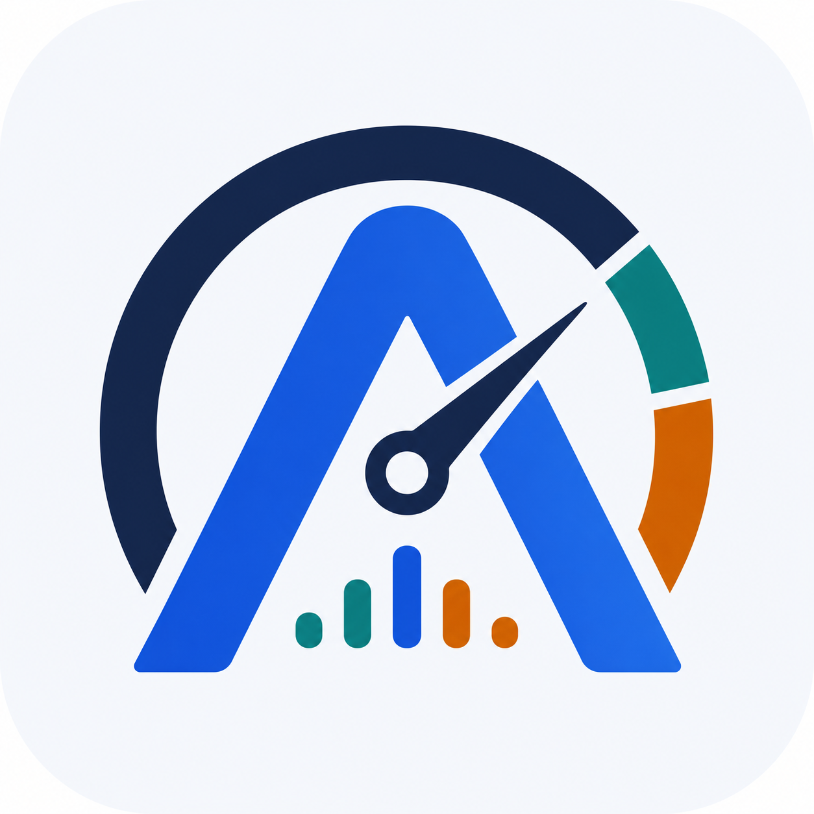

# AgentMeter

<p align="center">
  
</p>


AgentMeter is a local-first dashboard for understanding coding-agent session
usage: tokens, estimated cost, timing, session history, and tool-call behavior.
It reads local agent JSONL session files, indexes them into SQLite, and shows
the data in private local Web and terminal interfaces.

No proxy, no cloud service, no telemetry.

## Why AgentMeter

Coding agents leave useful local session data behind, but raw JSONL is hard to
inspect directly. AgentMeter turns that data into answers you can use:

- How many sessions did I run?
- How many tokens did they consume?
- What did those tokens roughly cost?
- Which models, days, projects, or sessions used the most?
- Which tools were called most often?
- How long did sessions and tool calls take?

## Features

- Local Web dashboard for sessions, tokens, estimated cost, daily usage, model
  usage, and tool-call analytics.
- Terminal UI mode over the same database, indexing pipeline, pricing rules, and
  query behavior.
- Codex, Claude Code, CodeBuddy, WorkBuddy, and generic JSONL source detection.
- Multiple source roots for developers running several local coding agents.
- Incremental SQLite indexing with source path traceability and parse status.
- Built-in pricing registry with unknown models clearly marked as `unpriced`.

## Quick Start

Requirements:

- Go matching the version in `go.mod`
- Node.js and npm

Recommended local start:

```sh
go run . -start
```

Open:

```text
http://127.0.0.1:34115
```

On first launch, click **Index Now** in the app. AgentMeter defaults to detected
local agent homes such as `~/.codex` and `~/.claude`; you can add more source
roots in **Settings**.

For manual startup, frontend HMR, TUI mode, data locations, and development
checks, see [Getting Started](docs/getting-started.md).

## Privacy Model

AgentMeter is designed to stay local:

- Reads local session files only.
- Does not proxy model traffic.
- Does not upload session data.
- Does not require a cloud account.
- Stores normalized data in a local SQLite database.

## Current Status

AgentMeter is an MVP for local coding-agent JSONL usage. The Web UI is the
default interface; the TUI is available as a terminal MVP over the same
application core.

See [Roadmap](docs/roadmap.md) for planned work.

## Documentation

- [Getting Started](docs/getting-started.md)
- [Project Brief](docs/project-brief.md)
- [Architecture](docs/architecture.md)
- [UI Modes](docs/ui-modes.md)
- [Data Model](docs/data-model.md)
- [Codex Session Format](docs/codex-session-format.md)
- [Pricing Sources](docs/pricing-sources.md)
- [Roadmap](docs/roadmap.md)

## Contributing

Issues and pull requests are welcome, especially for parser edge cases, pricing
updates, packaging, and adapters for other coding agents.
