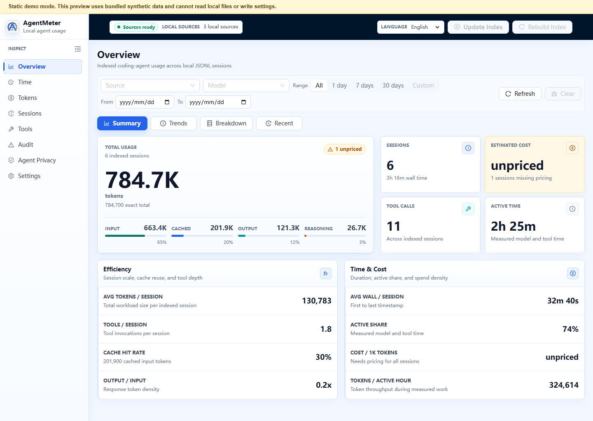

# AgentMeter

[中文](README.zh-CN.md) | [English](README.md)

<p align="center">
  
</p>

<p align="center">
  <strong>面向 coding agent 的本地优先用量分析：token、成本、耗时、会话和工具调用。</strong>
</p>

<p align="center">
  <a href="https://lylemi.github.io/AgentMeter/">在线演示</a>
  · <a href="https://github.com/LyleMi/AgentMeter/releases">下载发布版</a>
  · <a href="docs/assets/screenshots/overview.png">截图</a>
  · <a href="docs/install.md">安装</a>
  · <a href="docs/privacy.md">隐私</a>
</p>


AgentMeter 是一个开源 Go + Vue 仪表盘，用于理解本地 coding-agent 会话
用量。它读取本地 agent JSONL 会话文件，将数据索引到 SQLite，并在私有的
本地 Web 仪表盘中展示 token、预估成本、耗时、会话历史、模型、项目、缓存
（cache）复用、工具调用行为和模型表现信号，同时终端界面复用同一份本地数据
提供摘要视图。

无代理、无云服务、无遥测。



## 一眼看懂

- **支持的 agent：** Codex、Claude Code、CodeBuddy、WorkBuddy 和通用
  JSONL 目录。
- **隐私模型：** 会话数据保留在你的机器上，存入本地 SQLite 数据库；
  AgentMeter 不代理流量，也不上传遥测。
- **主要视图：** 会话、每日用量、模型、项目、缓存（cache）复用、预估
  成本、模型信号、工具调用分析，以及离线命令/隐私审计发现。
- **界面形态：** 默认使用本地 Web 仪表盘，也提供复用同一数据库和查询行为
  的终端 UI。
- **发布资产：** 跨平台压缩包发布在
  [GitHub Releases](https://github.com/LyleMi/AgentMeter/releases)，命名为
  `AgentMeter-<platform>-<arch>`。

## 为什么需要 AgentMeter

Coding agent 会在本地留下有用的会话数据，但原始 JSONL 不适合直接查看。
AgentMeter 将这些数据整理成可以直接回答的问题：

- 我运行了多少个会话？
- 这些会话消耗了多少 token？
- 这些 token 大致花费了多少？
- 哪些模型、日期、项目或会话的用量最高？
- 按日期、模型或项目看，缓存命中表现是否稳定？
- 哪些模型表现出异常的扩展率、吞吐、缓存未命中或工具使用信号？
- 哪些工具被调用得最多？
- 会话和工具调用分别耗时多久？

## 功能

- 本地 Web 仪表盘，可查看会话、token、预估成本、每日用量、模型用量、
  项目用量、按日期/模型/项目的缓存命中趋势和工具调用分析。
- 模型表现信号，用于查看输出扩展、reasoning 占比、缓存未命中、吞吐、
  工具依赖、工具失败和异常会话等操作性代理指标。
- 离线审计视图，可从已索引的本地会话数据中查看命令风险和隐私/密钥发现。
- 终端 UI 模式复用同一套数据库、索引流水线、计价规则和查询行为。
- 支持检测 Codex、Claude Code、CodeBuddy、WorkBuddy 以及通用 JSONL
  数据源。
- 支持多个带标签的数据源实例，适合同时运行多个本地 coding agent，或同一
  agent family 的多个根目录。
- 使用 SQLite 增量索引，保留源路径可追溯性和解析状态。
- 内置价格注册表，未知模型会清晰标记为 `unpriced`。

## 快速开始

如需使用打包版本，请从
[Releases](https://github.com/LyleMi/AgentMeter/releases) 下载匹配的
`AgentMeter-<platform>-<arch>` 资产。如需从源码本地启动，请使用下面的命令。

要求：

- Go 版本与 `go.mod` 中声明的版本匹配
- Node.js 和 npm

推荐的本地启动方式：

```sh
go run . -start
# 等同于：
go run . start
```

打开：

```text
http://127.0.0.1:34115
```

## 首次索引

首次启动后，在应用中点击 **Update Index**。AgentMeter 默认会检测本地
agent 主目录，例如 `~/.codex` 和 `~/.claude`；你也可以在 **Settings**
中添加更多数据源根目录，并在路径不够清晰时添加手动标签。一个 source
instance 表示一个本地根目录；agent family（例如 `codex`、`claude`）
用于解析行为和 family 级过滤。

**Update Index** 只扫描新增或变更过的 JSONL 文件；**Rebuild Index**
会清空已启用数据源的已索引文件记录，并重新解析全部文件。

如需手动启动、前端 HMR、TUI 模式、数据位置和开发检查，请参阅
[Getting Started](docs/getting-started.md)。

终端 UI 快捷启动方式：

```sh
go run . tui
# 或：
go run . cli
```

隐私配置 CLI：

```sh
go run . privacy status
go run . privacy settings codex
go run . privacy apply codex
go run . privacy apply all recommended
go run . privacy apply gemini strict
```

`privacy apply <target>` 默认使用 recommended 配置档。支持的目标包括
`codex`、`gemini`、`claude` 和 `codebuddy`；写入已有配置文件前，
AgentMeter 会先创建备份。隐私目标是用户级 agent 配置，不是已索引的
source instance，因此写入不会只作用于某一个手动数据源标签。

## 隐私模型

AgentMeter 设计为留在本地运行：

- 只读取本地会话文件。
- 不代理模型流量。
- 不上传会话数据。
- 不需要云账号。
- 将标准化后的数据存储在本地 SQLite 数据库中。
- 审计发现可能保存本地原始证据，便于在不离开本机的前提下排查命令和隐私问题。

## 当前状态

AgentMeter 目前是面向本地 coding-agent JSONL 用量分析的 MVP。Web UI 是
默认界面；TUI 是基于同一应用核心的终端 MVP。

后续计划请参阅 [Roadmap](docs/roadmap.md)。

## 文档

- [安装](docs/install.md)
- [支持的 Agent](docs/supported-agents.md)
- [隐私](docs/privacy.md)
- [对比](docs/comparison.md)
- [Release Distribution](docs/release-distribution.md)
- [Getting Started](docs/getting-started.md)
- [Project Brief](docs/project-brief.md)
- [Architecture](docs/architecture.md)
- [UI Modes](docs/ui-modes.md)
- [Data Model](docs/data-model.md)
- [模型信号](docs/model-signals.md)
- [Session Formats](docs/session-formats.md)
- [Pricing Sources](docs/pricing-sources.md)
- [Validation](docs/validation.md)
- [Roadmap](docs/roadmap.md)

## 贡献

欢迎提交 issue 和 pull request，尤其是 parser 边界情况、价格更新、打包，
以及面向其他 coding agent 的 adapter。
